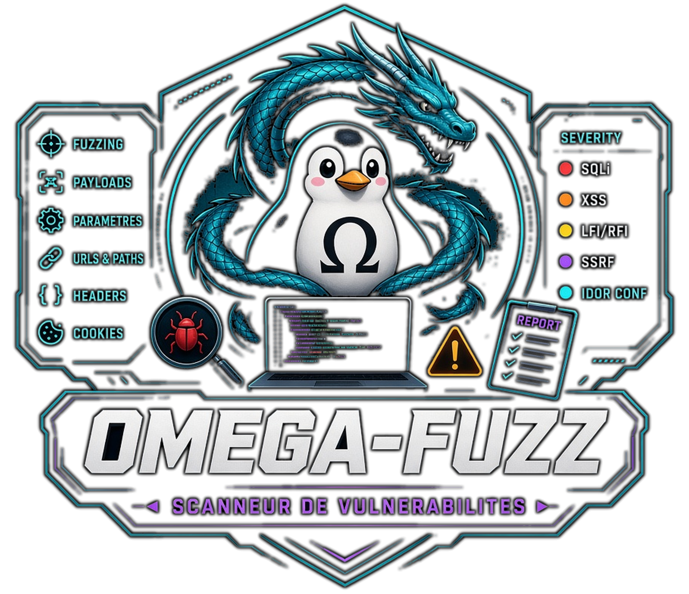

<!-- Copyright (c) 2026 kraynux - kraynux@proton.me - Licencia MIT (véase el archivo LICENSE) -->
<div align="center">
  
</div>

# 🗱 OMEGA-FUZZ

**Escáner de vulnerabilidades**

> Desarrollado por **kraynux** para **Omega-server**  
[https://kraynux.snake-mackarel.ts.net](https://kraynux.snake-mackarel.ts.net)

Página oficial: [OMEGA-FUZZ](https://kraynux.snake-mackarel.ts.net/omega-fuzz/) &nbsp; Vista previa: [Screenshots](https://kraynux.snake-mackarel.ts.net/omega-fuzz/screenshots/)  

[](LICENSE)
[](https://www.python.org/)
[](https://www.linux.org/)
[](https://github.com/Textualize/rich)

**Idiomas:**  
[Français](README.md) · [English](README.en.md) · [Español](README.es.md) · [Русский](README.ru.md) · [中文](README.zh-CN.md)

**Omega-Fuzz** es una aplicación local de terminal (TUI [Textual](https://github.com/Textualize/textual) + CLI programable mediante scripts) que ejecuta descubrimiento y pruebas de seguridad web (fuzzing HTTP) en entornos autorizados (laboratorios, espejos personales y pruebas autorizadas explícitamente).

Es la sexta herramienta de la suite `omega-` (después de `omega-scan`, `omega-stress`, `omega-check`, `omega-deep` y `omega-fold`) y está estructurada según Clean Architecture. Consulte `docs/ARCHITECTURE.md` para conocer todos los detalles técnicos.

## 1. Visión y alcance

### Qué hace Omega-Fuzz

- Descubre el alcance de un único objetivo mediante BFS limitado por un scope explícito (esquema/subdominios/rutas permitidas o bloqueadas/profundidad), siempre con mecanismos de protección.
- Realiza fuzzing genérico de parámetros de query string, cabeceras HTTP y formularios `GET` encontrados en cada URL descubierta, y comprueba tres familias de firmas: XSS reflejado no destructivo, inyección genérica (detección de errores en la respuesta) y cabeceras de seguridad ausentes o mal configuradas. Consulte [§5](#5-pruebas-de-seguridad-ejecutadas).
- Puntúa cada anomalía en tres ejes (impacto/explotabilidad/alcance) y deduce una gravedad (`low`/`medium`/`high`/`critical`), eliminando duplicados por `(type, endpoint, parameter)` y conservando la mejor evidencia. Consulte [§6](#6-puntuación-y-gravedad).
- Admite autenticación (cookie, bearer token y formulario de inicio de sesión) mediante un archivo YAML específico; nunca se incluyen credenciales en la línea de comandos.
- Muestra los resultados en la TUI (Textual) o mediante una CLI programable, con tres formatos de exportación (JSON, Markdown y HTML con 5 temas).
- Conserva un historial persistente de los escaneos y sus findings (SQLite), además de una lista reutilizable de objetivos favoritos.
- Exige confirmación explícita (una frase estricta en los casos más sensibles) antes de cualquier escaneo agresivo, extendido o con la verificación TLS desactivada.

### Qué no hace Omega-Fuzz

- Fuzzing de cuerpos JSON: el código existe (`plugins/fuzzers/json_body_fuzzer.py`), pero no está conectado (el descubrimiento HTML/BFS no produce ningún esquema de API JSON ni ninguna fuente de plantillas utilizable).
- Fuzzing de formularios `POST`/`PUT`/`DELETE`: se excluye deliberadamente del pipeline automático (riesgo de escrituras no deseadas en el objetivo); solo se prueban formularios `GET`.
- Pruebas de lógica de negocio (IDOR, controles de autorización y fallos de workflow): el código existe (`plugins/logic_tests/`), pero permanece fuera del pipeline automático y solo puede invocarse por separado; nunca se activa mediante un escaneo estándar.
- Escaneo paralelo de varios objetivos: un único objetivo por escaneo.
- Repetición, comparación o exportación desde la pantalla Historial: solo se conservan `Scan` y `Finding` (no la configuración efectiva completa ni las solicitudes); repetir o exportar de nuevo desde el historial fabricaría datos, por lo que la pantalla lo explica en lugar de ofrecerlo silenciosamente.
- Renderizado de JavaScript del lado del cliente (la página se recupera tal como se sirve, sin ejecutarse en un navegador headless).
- Panel web.

## 2. Instalación

### Requisitos previos

- Python 3.10+
- Conexión a Internet para las dependencias
- Para la TUI: una [Nerd Font](https://www.nerdfonts.com/) instalada en el terminal para el icono del encabezado. Sin ella, el carácter aparece como un cuadrado vacío (la misma limitación que un emoji, aunque está mucho más disponible entre los usuarios de terminal). Su ausencia no afecta al funcionamiento y es puramente estética.

### Instalación

```bash
[ -d omega-fuzz ] && echo "ℹ️ Ya se ha extraído aquí; se omite este paso." || tar -xzf omega-fuzz.tar.gz
cd omega-fuzz/
chmod +x install.sh
./install.sh
```

`install.sh`:

1. Crea el entorno virtual `.venv` si todavía no existe.
2. Instala las dependencias (`vendor/omega-lib/` y después `pip install -e .`; `pyproject.toml` sigue siendo la única fuente de verdad).
3. Hace ejecutables `omega-fuzz.sh` e `install.sh`.
4. Añade el alias `fuzz` a `~/.bashrc` y `~/.zshrc` (sin duplicarlo si ya está presente).

### Dependencias

Declaradas en `pyproject.toml` (no existe `requirements.txt`):
- `omega-lib`: biblioteca compartida de la suite (temas de exportación, detección del terminal, `ConfidenceLevel`), incluida en `vendor/omega-lib/`
- `httpx`: solicitudes HTTP asíncronas (descubrimiento + fuzzing), streaming de la respuesta (nunca se mantiene un búfer completo en memoria, incluso con un archivo de varios GB servido por el objetivo)
- `beautifulsoup4` + `lxml`: extracción de URLs y formularios HTML
- `jinja2`: plantillas para la exportación HTML
- `textual`: interfaz TUI, temas y adaptación automática al terminal
- `pyyaml`: carga del archivo `--auth-config`
- Dependencias de desarrollo (`pip install -e ".[dev]"`): `pytest`, `pytest-asyncio`, `pytest-cov`, `pytest-httpserver`, `ruff`, `mypy`, `import-linter`

## 3. Uso

### Modo interactivo (TUI)

Recomendado para el uso diario; se inicia sin argumentos:

```bash
./omega-fuzz.sh
```
Si ha creado el alias, escriba simplemente `fuzz` en el terminal:
```bash
fuzz
```

Flujo: pantalla de inicio (se cierra al pulsar una tecla o hacer clic) → menú principal (Scanner / Objetivos / Ajustes / Historial / Ayuda) → entrada del objetivo (URL completa, esquema `http://`/`https://` obligatorio), preset o configuración manual (scope + agresividad), autenticación opcional, verificación TLS y límites personalizados → pantalla de revisión (confirmación simple o la frase estricta `OUI-J-AI-L-AUTORISATION` para casos sensibles) → escaneo (indicador indeterminado, botón **Detener** disponible en todo momento) → resultados (findings y exportación) → historial (detalles de un escaneo anterior y sus findings asociados) y objetivos favoritos desde el menú principal. La adaptación al terminal (colores, tamaño y degradación estructural) es automática.

#### Atajos de teclado

| Tecla | Acción |
|---|---|
| `↑` / `↓` | Moverse entre los elementos de una pantalla |
| `Tab` / `Shift+Tab` | Moverse entre los campos de un formulario |
| `Esc` | Volver a la pantalla anterior (confirmación de salida en la pantalla de inicio) |
| `t` | Siguiente tema (se aplica inmediatamente, sin confirmación) |
| `r` | Actualizar la detección del terminal |
| `a` | Mostrar la ayuda (incluida la tabla de presets) |
| `q` | Salir (con confirmación) |
| `Ctrl+P` | Paleta de comandos (Theme, Quit, Screenshot) |

### Modo programable (CLI)

```bash
# Escaneo con un preset listo para usar
./omega-fuzz.sh scan --target https://example.com --preset prod-safe

# Combinación manual de scope + agresividad (sin preset)
./omega-fuzz.sh scan --target https://example.com --scope-profile standard --aggressiveness standard

# Con autenticación (archivo YAML; nunca incluya credenciales en la línea de comandos)
./omega-fuzz.sh scan --target https://example.com --preset staging-full --auth-config auth.yaml

# Dry run: configuración efectiva y plan estimado; no se envían solicitudes
./omega-fuzz.sh scan --target https://example.com --preset prod-safe --dry-run

# Exportación específica (directorio, formatos, tema HTML)
./omega-fuzz.sh scan --target https://example.com --preset prod-safe \
    --output-dir ./rapports --format html --export-theme omega-neon
```

Opciones de `scan`:

| Opción | Valor predeterminado | Efecto |
|---|---|---|
| `--target` | *(obligatorio)* | URL objetivo; esquema `http://`/`https://` obligatorio (nunca se completa automáticamente) |
| `--preset` | — | Preset listo para usar (consulte [§4](#4-perfiles-de-scope-y-presets)) |
| `--scope-profile` | — | Perfil de scope, para combinar con `--aggressiveness`, sin `--preset` |
| `--aggressiveness` | — | Nivel de agresividad, para combinar con `--scope-profile`, sin `--preset` |
| `--auth-config` | — | Archivo YAML de autenticación |
| `--insecure-tls` | desactivado | Desactiva la verificación TLS (activa la confirmación reforzada) |
| `--max-duration` | *(del perfil)* | Sobrescribe la duración máxima (segundos) |
| `--max-requests` | *(del perfil)* | Sobrescribe el número máximo de solicitudes |
| `--max-tests` | *(del perfil)* | Sobrescribe el número máximo de pruebas |
| `--max-concurrent` | *(del perfil)* | Sobrescribe la concurrencia máxima |
| `--dry-run` | desactivado | Muestra la configuración efectiva y el plan estimado; no envía solicitudes |
| `--output-dir` | `var/exports/` | Directorio de informes exportados, con nombre `<preset>-<timestamp>.<ext>` (se puede cambiar en Ajustes) |
| `--format` | `all` | `json`, `markdown`, `html` o `all` |
| `--export-theme` | `omega-base` | Tema del informe HTML exportado (sin efecto sobre json/markdown) |

No existe un subcomando `history`/`show` en la CLI: el historial y los objetivos favoritos solo se pueden consultar desde la TUI.

Si `install.sh` creó el alias, `fuzz scan ...` funciona desde cualquier ubicación del terminal, sin el prefijo `./omega-fuzz.sh`.

## 4. Perfiles de scope y presets

### Perfiles de scope

| Perfil | Modo | Profundidad máxima | Restricciones |
|---|---|---|---|
| `strict` | objetivo exacto | 1 | Bloquea `/health`, `/ready`, `/metrics`, `/favicon.ico`, `/robots.txt` |
| `standard` | + subdominios | 2 | Bloquea subdominios estáticos habituales, rutas técnicas y recursos (images/css/js/fonts) |
| `large` | + subdominios | 4 | Bloquea únicamente rutas técnicas y recursos (incluidos archivos/PDF) |
| `api` | objetivo exacto | 3 | Restringido a `/api`, `/v1`, `/v2`; bloquea documentación y recursos |
| `custom` | + subdominios | 3 | Sin restricciones predeterminadas; punto de partida para una configuración manual |

Independientemente del perfil elegido, una lista de extensiones binarias o voluminosas (`.iso`, `.zip`, `.exe`, `.mp4`...) queda **siempre** excluida del crawling y del fuzzing, incluso con `custom`. Un enlace a un archivo de este tipo nunca se recupera mediante una solicitud HTTP real, para evitar que un directorio de descargas ralentice un escaneo durante muchos minutos.

### Niveles de agresividad

`doux` · `standard` · `agressif` · `violent`: cada uno tiene sus propios límites básicos (duración, solicitudes, pruebas, profundidad y concurrencia), que un preset puede sobrescribir cuando corresponde.

### Presets listos para usar

| Preset | Scope | Agresividad | Duración máxima | Solicitudes máximas | Pruebas máximas | Profundidad máxima | Confirmación reforzada |
|---|---|---|---|---|---|---|---|
| `prod-safe` | strict | doux | 300 s | 1.000 | 500 | 1 | no |
| `staging-full` | standard | standard | 1.800 s | 20.000 | 10.000 | 2 | no |
| `lab-deep` | large | agressif | 3.600 s | 100.000 | 50.000 | 4 | no |
| `lab-extreme` | large | violent | 7.200 s | 500.000 | 250.000 | 5 | **sí** |
| `api-hardened` | api | agressif | 1.800 s | 50.000 | 25.000 | 3 | no |

Un escaneo permanece bloqueado hasta que se confirma. Se requiere confirmación **reforzada** (debe introducirse exactamente la frase `OUI-J-AI-L-AUTORISATION`) cuando está presente uno de estos tres factores: agresividad `violent`, preset `lab-extreme` o verificación TLS desactivada (`--insecure-tls`). Sin ninguno de ellos, una combinación inusual requiere una confirmación simple de sí/no.

## 5. Pruebas de seguridad ejecutadas

Pipeline automático sobre cada URL descubierta dentro del scope y cada formulario `GET` encontrado allí:

| Prueba | Activación | Qué se comprueba |
|---|---|---|
| Fuzzing genérico de parámetros | Cada parámetro de query string | Comportamiento del objetivo ante valores límite o malformados |
| Fuzzing de cabeceras | Una vez por URL, 4 cabeceras fijas (`User-Agent`, `Referer`, `X-Forwarded-For`, `Accept-Language`) | Comportamiento del objetivo ante valores límite o malformados en una cabecera |
| Fuzzing de formularios (`GET` únicamente) | Cada campo de formulario `GET` descubierto dentro del scope | Comportamiento del objetivo ante valores límite o malformados en un campo |
| XSS reflejado | Cada parámetro de query string | Reflexión no filtrada de un payload en la respuesta (no destructiva) |
| Inyección genérica | Cada parámetro de query string | Detección de un error del servidor en respuesta a un payload de inyección (sin fingerprinting SQL/NoSQL específico) |
| Cabeceras de seguridad | Una vez por URL | Cabeceras de seguridad ausentes o mal configuradas en la respuesta |

Las tres primeras pruebas (fuzzing genérico de parámetros/cabeceras/formularios) son un motor de mutación **sin detección**: nunca generan directamente un `Finding`; únicamente se contabilizan los errores del servidor (5xx) encontrados en el `Test` correspondiente. Solo las firmas (XSS, inyección y cabeceras de seguridad) generan findings.

## 6. Puntuación y gravedad

Cada anomalía detectada se puntúa en tres ejes (`impact`, `exploitability`, `scope`, de 1 a 5 cada uno), según la naturaleza de la observación. El mapeo es deliberadamente **conservador** (extremo inferior del intervalo y sin confirmación humana en esta fase automática):

| Puntuación bruta (suma de los 3 ejes) | Gravedad |
|---|---|
| ≥ 13 | `critical` |
| ≥ 10 | `high` |
| ≥ 7 | `medium` |
| < 7 | `low` |

Es posible realizar un ajuste manual (`severity_override`), pero siempre exige una justificación explícita. Los findings equivalentes (mismo tipo, endpoint y parámetro) se deduplican conservando la mejor evidencia disponible (nivel de confianza `omega_lib.core.confidence.ConfidenceLevel` y, en caso de empate, puntuación bruta).

## 7. Autenticación

Archivo YAML específico (`--auth-config`); nunca se incluyen credenciales en la línea de comandos:

| Modo | Efecto |
|---|---|
| `none` | Sin autenticación (predeterminado) |
| `cookie` | Cookie de sesión proporcionada directamente |
| `bearer_token` | Token `Authorization: Bearer ...` |
| `login_form` | Autenticación mediante formulario (URL de inicio de sesión y campos de usuario/contraseña) |

## 8. Arquitectura

Omega-Fuzz está estructurado según **Clean Architecture** (domain / application / infrastructure / interfaces / ports / core / app / plugins), alineada con la plantilla de la suite `omega-` (consulte `omega-check`/`omega-deep`/`omega-fold`) y verificada por `import-linter` después de cada modificación. Los detalles completos están en **`docs/ARCHITECTURE.md`**.

Vista general muy breve:

```text
src/omega_fuzz/
├── domain/          Lógica de negocio pura (objetivos/scope, solicitudes, pruebas, findings, perfiles, informes...)
├── application/     Casos de uso (commands/queries) y orquestadores (descubrimiento, escaneo, informe, límites)
├── ports/           Contratos esperados por la aplicación (http_client, repositories, exporters...)
├── infrastructure/  Implementaciones concretas (httpx, BeautifulSoup, SQLite, exportadores Jinja2 — Textual NO está aquí)
├── interfaces/      tui/ (Textual) y cli/ (programable), con paridad funcional estricta
├── plugins/         Fuzzers y firmas (funciones puras, sin acceso directo a la red)
├── app/             Ensamblaje (Container, composition root, ciclo de vida)
└── core/            Vocabulario transversal, errores y constantes
```

Reglas de diseño:
- `plugins/fuzzers/` y `plugins/signatures/`: funciones puras que construyen planes de prueba (`Test` + `ScanRequest`); nunca acceden a `HttpClient`.
- `infrastructure/network/`: realiza la red (`httpx`, streaming limitado en memoria); nunca emite juicios.
- `infrastructure/analyzers/`: lee una respuesta ya recibida y produce objetos `Observation` estructurados; nunca recalcula una puntuación.
- `interfaces/`: muestra información y no contiene lógica de negocio.

## 9. Exportaciones

Los informes se generan en `var/exports/` de forma predeterminada (ruta de ejecución anclada al directorio del proyecto, `$OMEGA_FUZZ_VAR_DIR` para sobrescribirla, también modificable en Ajustes) o en la ruta indicada por `--output-dir`. Nombre plano, sin subdirectorios: `<preset>-<timestamp>.<ext>` (por ejemplo, `prod-safe-2026-09-01_14-30-22.html`).

### JSON, fuente de verdad

Estructura completa del informe (configuración efectiva, estadísticas, pruebas y findings), estrictamente serializable como JSON.

### Markdown, informe humano compacto

Legible fuera del terminal y sin códigos ANSI.

### HTML, informe web autónomo

5 temas disponibles (`--export-theme` en la CLI y selector en la TUI): `omega-base`, `omega-burn`, `omega-neon`, `light-basic`, `light-alt`.

## 10. Historial y objetivos favoritos

Cada escaneo se conserva (SQLite, `var/db/omega-fuzz.db`) junto con sus findings y puede consultarse desde la pantalla Historial de la TUI. Solo se almacenan `Scan` y `Finding`, no la configuración efectiva ni las solicitudes detalladas; por tanto, esta pantalla no permite repetir, comparar ni generar una nueva exportación (lo explica en lugar de fabricar datos).

La pantalla **Objetivos** conserva una lista de favoritos (URLs normalizadas, `var/targets.json`) que puede reutilizarse para rellenar directamente el campo Objetivo de un nuevo escaneo.

## 11. Capturas de pantalla

El comando **Screenshot** de la paleta (`Ctrl+P`) guarda un SVG de la pantalla TUI actual en `var/screenshots/` de forma predeterminada. Puede cambiarse en Ajustes, igual que el directorio de exportación. Ajustes también ofrece una purga específica.

## 12. Compatibilidad con terminales

La TUI (Textual) detecta automáticamente las capacidades del terminal (emulador y tamaño) y adapta en consecuencia su hoja de estilos estructural (`complete`/`standard`/`reduced`/`mono`), sin necesidad de una opción manual. El modo CLI sigue siendo siempre texto simple e independiente del terminal. Esta política es compartida por toda la suite `omega-` (`omega-lib`, `terminal/policies.py`).

### Perfil según el emulador detectado

| Emulador | Perfil inicial |
|---|---|
| Ghostty, Alacritty, WezTerm, Kitty | `complete` |
| Konsole, GNOME Terminal, Terminator, Xfce4 Terminal | `standard` |
| xterm, urxvt, SSH moderno | `reduced` |
| TTY Linux, SSH antiguo | `mono` |
| Emulador no reconocido | `reduced` (fallback predeterminado) |

### Perfil según el tamaño del terminal

| Tamaño mínimo (columnas × filas) | Límite del perfil |
|---|---|
| 120 × 32 | `complete` |
| 100 × 28 | `standard` |
| 80 × 24 | `reduced` |
| inferior | `mono` |

El perfil final es **el más restrictivo de los dos** (emulador y tamaño) y puede actualizarse en directo con la tecla `r`.

## 13. Pruebas

```bash
source .venv/bin/activate
lint-imports        # comprueba la Dependency Rule (6 contratos)
pytest -q           # 317 tests
ruff check src tests
mypy -p omega_fuzz
```

Estructura: `tests/unit/` (dominio y aplicación, sin I/O real), `tests/integration/` (filesystem real mediante `tmp_path`, servidor HTTP falso con `pytest-httpserver`, base de datos SQLite real y CLI de extremo a extremo), `tests/tui/` (navegación mediante `Pilot`, estructural; sin afirmar verificación visual automatizada).

## 14. Fuera de alcance

- Fuzzing de cuerpos JSON (código presente, no conectado; sin descubrimiento de esquemas de API)
- Fuzzing de formularios `POST`/`PUT`/`DELETE` (excluido por diseño, riesgo de escritura)
- Pruebas de lógica de negocio (IDOR, autorización y workflow), fuera de la invocación manual
- Escaneo simultáneo de varios objetivos
- Repetición, comparación o exportación desde el historial
- Renderizado de JavaScript del lado del cliente
- Panel web

---

> Omega-Fuzz — Descubrir un alcance, probarlo con mecanismos de protección explícitos y nunca adivinar lo que no ha sido confirmado.
